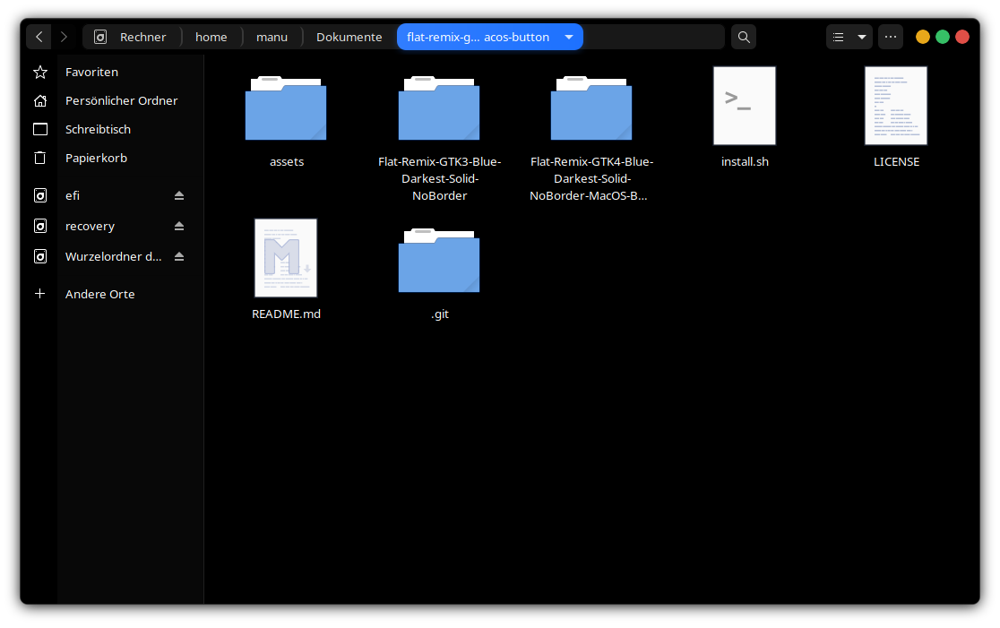

I modified the orignial darkest blue theme so that totally everything window related is black and the minimize, maximize and close buttons have mac os colors because i like that look the most.

|               | **Color**                                                                                              | **Button**                                           |
|:--------------|:-------------------------------------------------------------------------------------------------------:|:--------------------------------------------------:|
| **Minimize**  |  <font color="#f1ae1b"> ```#f1ae1b``` </font> |   |
| **Maximize**  |  <font color="#38c76a"> ```#38c76a``` </font> |  |
| **Close**     |  <font color="#e9524a"> ```#e9524a``` </font> |      |


